```mermaid
graph TD
    %% Styling for different device types
    classDef gateway fill:#e1f5fe,stroke:#01579b,stroke-width:2px
    classDef firewall fill:#fff3e0,stroke:#e65100,stroke-width:2px
    classDef switch fill:#f3e5f5,stroke:#4a148c,stroke-width:2px
    classDef server fill:#e8f5e8,stroke:#1b5e20,stroke-width:2px
    classDef external fill:#fce4ec,stroke:#880e4f,stroke-width:2px
    classDef carrier fill:#fff9c4,stroke:#f57f17,stroke-width:2px
    classDef cloud fill:#e3f2fd,stroke:#0277bd,stroke-width:2px
    classDef wireless fill:#f1f8e9,stroke:#33691e,stroke-width:2px

    %% External Infrastructure
    subgraph External["🌍 External Infrastructure"]
        ISP["🌐 ISP Uplink<br/>Internet Provider"]:::external
        GuestAP["📡 Guest AP<br/>ISP Provided WiFi"]:::wireless
        FabricAP["📶 Fabric AP<br/>TP-Link WiFi"]:::wireless
        Bastion["💻 Bastion<br/>MacOS Workstation"]:::external
    end

    %% Kubernetes Infrastructure
    subgraph K8sInfra["☸️ Kubernetes Infrastructure"]
        KCM["🎛️ KCM<br/>k0s + Cilium + Rook/Ceph<br/>Cluster Manager"]:::cloud
        Harbor["🏔️ Harbor<br/>k0s + Cilium + Rook/Ceph<br/>CR + Vault + Coder + Gitea + Omada + FlexLM + SonarQube"]:::cloud
    end

    %% Cloud Carriers
    subgraph CloudCarriers["☁️ Cloud Carriers"]
        HomeCarrier["🏠 Home Carrier<br/>k0s + kubevirt + Cilium + Rook/Ceph<br/>Hosts Cruiser/Knative (CAPI CSI)"]:::carrier
        ProdCarrier["🏭 Prod Carrier<br/>k0s + OpenStack + Cilium + Rook/Ceph<br/>Hosts Cruiser/Knative (CAPI CSI)"]:::carrier
    end

    %% Legacy Infrastructure  
    subgraph Legacy["🛠️ Legacy Infrastructure"]
        DevCarrier["🔧 Dev Carrier<br/>vSphere (Legacy)"]:::carrier
    end

    %% Cloud Services
    subgraph CloudServices["🌥️ Cloud Services"]
        Cruiser1["🚢 Cruiser-1<br/>Knative Serverless"]:::cloud
        Cruiser2["🚢 Cruiser-2<br/>Knative Serverless"]:::cloud
    end

    %% Network Gateways
    subgraph Gateways["🚪 Network Gateways"]
        AGW["🏛️ AGW<br/>VyOS Core Gateway"]:::gateway
        EGW["🌐 EGW<br/>VyOS Edge Gateway"]:::gateway
    end

    %% Security Layer
    subgraph Security["🔒 Security Layer"]
        PA440["🛡️ Palo Alto PA-440<br/>Next-Gen Firewall"]:::firewall
    end

    %% Switch Infrastructure
    subgraph Switches["🔌 Switch Infrastructure"]
        ADMSW["⚙️ ADMSW<br/>Admin/Management Switch<br/>Dell N1108EP-ON"]:::switch
        ESW["🌍 ESW<br/>Edge Access Switch<br/>Dell N1108EP-ON"]:::switch
        LSW1["🍃 LSW1<br/>Leaf Switch 1<br/>Dell N1108EP-ON"]:::switch
        LSW2["🍃 LSW2<br/>Leaf Switch 2<br/>Dell N1108EP-ON"]:::switch
    end

    %% Management & Services
    subgraph Management["🛠️ Management & Services"]
        IPMI["🔧 IPMI Management<br/>Server BMC Network"]:::server
        MAAS["🤖 MAAS Server<br/>Provisioning + Vault + SoftHSM<br/>DNS/DHCP/NTP Services"]:::server
    end

    %% External Uplinks (Physical)
    EGW <-->|"eth0<br/>WAN uplink"| ISP
    EGW <-->|"eth1<br/>Guest WiFi"| GuestAP

    %% Wireless Infrastructure
    ESW <-->|"Gi1/0/8<br/>Fabric WiFi"| FabricAP

    %% ESW Physical Connections
    ESW <-->|"Gi1/0/1<br/>OAM"| HomeCarrier
    ESW <-->|"Gi1/0/2<br/>CNI/CSI"| HomeCarrier
    ESW <-->|"Gi1/0/3<br/>VIP"| HomeCarrier
    ESW <-->|"Gi1/0/4<br/>Direct"| Bastion

    %% Admin Switch Physical Connections
    ADMSW <-->|"Gi1/0/1<br/>OAM"| KCM
    ADMSW <-->|"Gi1/0/2<br/>OAM"| Harbor
    ADMSW <-->|"Gi1/0/5<br/>IPMI"| DevCarrier
    ADMSW <-->|"Gi1/0/6<br/>OAM"| DevCarrier
    ADMSW <-->|"Gi1/0/7<br/>IPMI"| ProdCarrier
    ADMSW <-->|"Gi1/0/8<br/>OAM"| ProdCarrier

    %% Gateway-Switch Connections
    AGW <-->|"eth0 ↔ Gi1/0/11<br/>Admin Network"| ADMSW
    EGW <-->|"eth2 ↔ Gi1/0/12<br/>Fabric Network"| ESW
    EGW <-->|"eth3 ↔ Gi1/0/12<br/>Admin Network"| ADMSW

    %% IPMI Direct Connection
    AGW -.->|"eth1<br/>IPMI Network"| IPMI

    %% Firewall Distribution Hub
    PA440 <-->|"eth1 ↔ Gi1/0/9<br/>VLAN 20 Mgmt"| ADMSW
    PA440 <-->|"eth2 ↔ Gi1/0/9<br/>VLAN 20 Mgmt"| ESW
    PA440 <-->|"eth3 ↔ Gi1/0/9<br/>VLAN 20 Mgmt"| LSW1
    PA440 <-->|"eth4 ↔ Gi1/0/9<br/>VLAN 20 Mgmt"| LSW2

    %% MAAS Multi-Switch Connectivity
    MAAS <-->|"eth0 ↔ Gi1/0/10<br/>Trunk VLAN 20/21"| ADMSW
    MAAS <-->|"eth1 ↔ Gi1/0/10<br/>VLAN 21 Provision"| ESW
    MAAS <-->|"eth2 ↔ Gi1/0/10<br/>VLAN 21 Provision"| LSW1
    MAAS <-->|"eth3 ↔ Gi1/0/10<br/>VLAN 21 Provision"| LSW2

    %% Future EVPN Inter-Switch Links
    ESW -.->|"Future EVPN<br/>Uplinks"| LSW1
    ESW -.->|"Future EVPN<br/>Uplinks"| LSW2

    %% Cloud Service Deployment Relationships
    HomeCarrier -.->|"Hosts"| Cruiser1
    ProdCarrier -.->|"Hosts"| Cruiser2

    %% Kubernetes Management Relationships
    KCM -.->|"Manages k0s Clusters"| Harbor
    KCM -.->|"Manages k0s Clusters"| HomeCarrier
    KCM -.->|"Manages k0s Clusters"| ProdCarrier

    %% Harbor Shared Services
    Harbor -.->|"Provides CR/Vault/Coder/Gitea/Omada/FlexLM/SonarQube"| HomeCarrier
    Harbor -.->|"Provides CR/Vault/Coder/Gitea/Omada/FlexLM/SonarQube"| ProdCarrier
    
    %% MAAS Vault Integration
    MAAS -.->|"Main Vault + SoftHSM"| Harbor
```

# Readme

[registry](https://registry.orb.local)

---

---

## Filesystem

- bin
- cache
  - .devcontainer
  - .yamllint.json
  - compose-dev.yaml
  - Dockerfile
  - init.code-workspace
- core
  - lib
  - templates
  - utils
    - scripts
    - tools
- home
  - .cache
  - Archive.zip
  - codespace
  - init
- root
- tmp
  - templates
- Archive.zip
- init

---

Copyright (c) 2025 Schubert Anselme <schubert@anselm.es>

This program is free software: you can redistribute it and/or modify
it under the terms of the GNU General Public License as published by
the Free Software Foundation, either version 3 of the License, or
(at your option) any later version.

This program is distributed in the hope that it will be useful,
but WITHOUT ANY WARRANTY; without even the implied warranty of
MERCHANTABILITY or FITNESS FOR A PARTICULAR PURPOSE. See the
GNU General Public License for more details.

You should have received a copy of the GNU General Public License
along with this program. If not, see <https://www.gnu.org/licenses/>.
